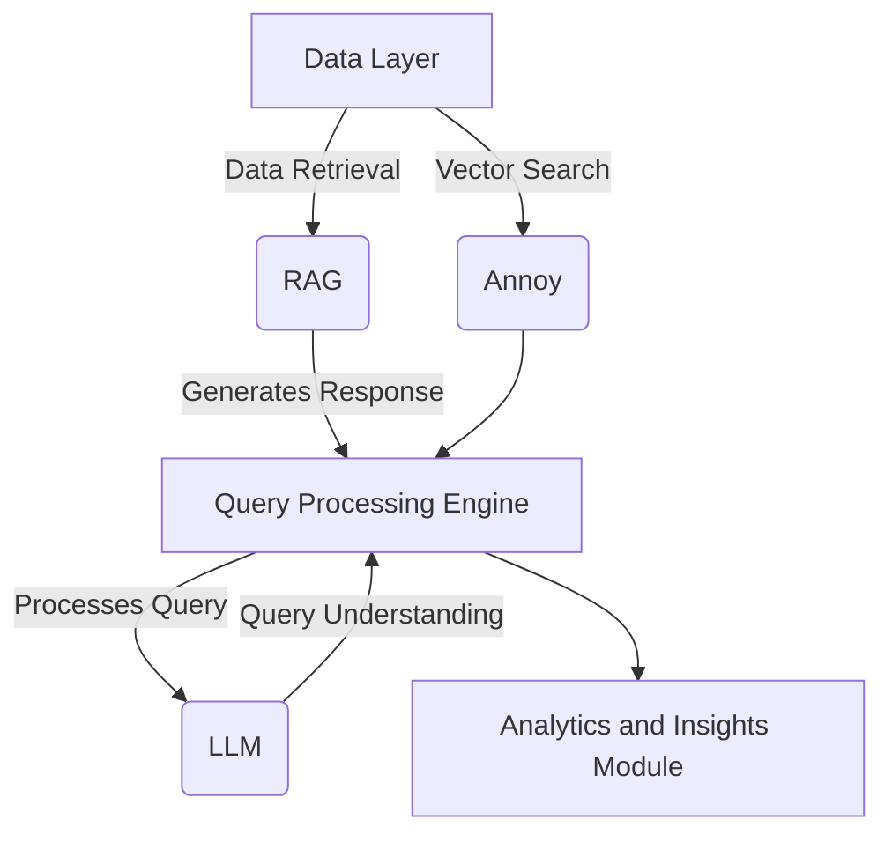
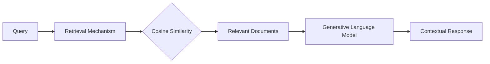
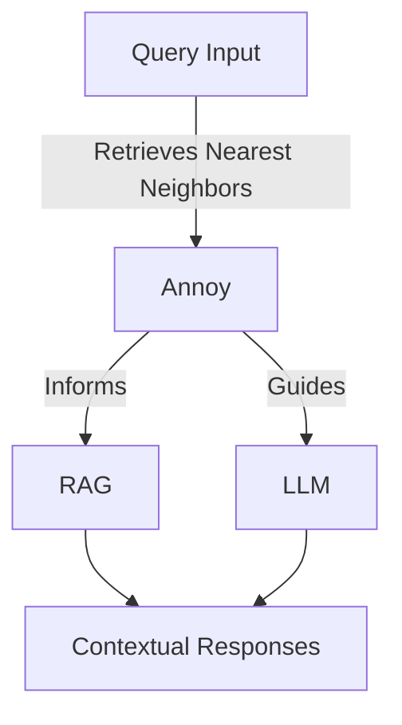

# Smart Retail Navigator: Unifying RAG, LLM, and Annoy for Advanced Query Intelligence

## Introduction

The Smart Retail Navigator project revolutionizes retail analytics by integrating cutting-edge AI technologies including Retrieval-Augmented Generation (RAG), Large Language Models (LLM), and Approximate Nearest Neighbors Oh Yeah (Annoy). This unified system delivers unmatched query intelligence capabilities to empower retailers in harnessing the full potential of their data for strategic decision making.

This README serves as a comprehensive guide to the Smart Retail Navigator's objectives, architecture, methodologies, technologies, and implementation. It is aimed at developers, data scientists, retail analysts, and technology strategists interested in leveraging AI to optimize retail performance.

## System Architecture

The Smart Retail Navigator system architecture combines RAG, LLM, and Annoy in an innovative way to enable scalable, efficient, and accurate retail data processing and analytics.

### Components

- **Data Layer**: Foundation of the system storing and managing retail data like sales, customer feedback, inventory etc. Structured for easy access.
- **Retrieval-Augmented Generation (RAG)**: Acts as bridge between raw data and insights. Retrieves relevant data to generate responses to queries by combining strengths of deep learning and information retrieval.
- **Large Language Models (LLM)**: Understand natural language queries and generate human-like, context-aware responses. Fine-tuned on retail data.
- **Annoy**: Used for efficient high-dimensional vector similarity search in data layer. Crucial for RAG to find most relevant data.
- **Query Processor**: Receives user queries, leverages LLM to understand intent, coordinates with RAG and Annoy to respond appropriately.
- **Analytics Module**: Utilizes RAG and LLM outputs to deliver analytics and actionable insights for decision making.

### Architectural Diagram

This diagram shows the flow of data and interactions in Smart Retail Navigator system.

The innovative architecture ensures scalability, efficiency and accuracy in addressing the advanced analytics needs of complex retail environments by synergistically integrating the latest AI technologies.

## Core Techniques & Technologies

The Smart Retail Navigator project implements several state-of-the-art techniques and technologies to deliver its advanced capabilities.

### Retrieval Augmented Generation (RAG)

RAG strategically combines information retrieval with generative language models to produce responses that are highly accurate as well as contextually relevant.

It retrieves the most relevant data from an extensive retail corpus corresponding to the query using cosine similarity. This contextual data is then utilized by the generative model to frame comprehensive responses.

By synergizing retrieval and generation, RAG generates nuanced and dynamic responses enhancing customer experience.

### Large Language Models (LLM)

LLMs like eCeLLM and DistilGPT-2 form the backbone of complex retail query understanding and human-like response generation.

**eCeLLM** focuses specifically on ecommerce domain providing exceptional accuracy for product-related queries by aligning closely with retail needs.

**DistilGPT-2** ensures quick processing crucial for real-time customer interactions while retaining coherence in text outputs.

The combination enables comprehensive query handling across diverse retail scenarios.

### Annoy

Annoy significantly boosts response relevance by rapidly retrieving the most pertinent information for any retail query.

It uses random projection trees to efficiently partition high-dimensional vector spaces, ensuring high accuracy and speed crucial for retail's massive data needs.

This allows RAG and LLM components to tailor responses specifically based on the contextual data.

## Implementation Details

The project implements complex data pipelines, algorithms and integrations demonstrating real-world development and deployment.

### Mock Data Generation

The `generate_retail_mock_data` function creates customizable mock retail product descriptions for testing and development purposes in absence of real datasets.

It generates structured and reproducible data covering diverse categories, specifications and features - crucial for building robust models.

### Annoy Integration

Annoy is integrated to index and query vectorized representations of product descriptions, enabling rapid identification of contextually relevant products/documents.

This is a common pattern in production recommendation systems requiring swift similarity based retrieval.

### RAG + LLM + Annoy Orchestration

An end-to-end workflow is implemented orchestrating the collaboration between RAG, LLM (HuggingFace transformers) and Annoy to process retail queries.

It demonstrates a practical solution combining strengths of retrieval and generative AI to boost response relevance in customer conversations.

## Conclusion

The Smart Retail Navigator project pioneers the synergistic unification of RAG, LLM and Annoy to unlock immense value from retail data via enhanced analytics and excellent customer experiences.

This README captures its objectives, architecture, technologies, implementations and key takeaways comprehensively to guide technologists in replicating similar systems.

Overall this project establishes a new frontier showcasing AI's true transformative potential for the retail sector.