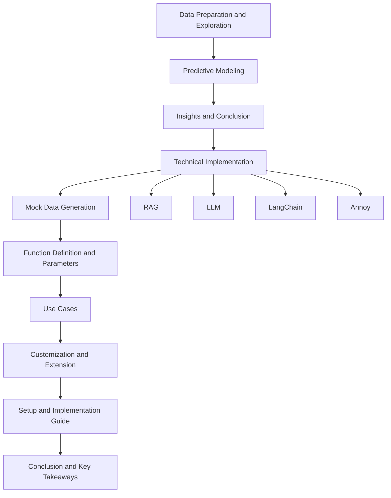
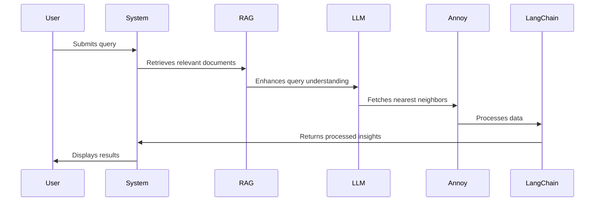

# Smart Retail Navigator: Unifying RAG, LLM, and Annoy for Advanced Query Intelligence

## Introduction

The Smart Retail Navigator project leverages cutting-edge AI technologies to redefine how retail data is analyzed and utilized. By integrating Retrieval-Augmented Generation (RAG), Large Language Models (LLM), and Annoy (Approximate Nearest Neighbors Oh Yeah) with LangChain, we aim to create a powerful tool for extracting insights and predicting trends in the retail sector.

## Sections Overview

### 1. Data Preparation and Exploration

This section provides an overview of the data sources and methodologies employed to prepare the dataset for analysis, ensuring a solid foundation for predictive modeling and insights generation.

### 2. Predictive Modeling and Analysis

Describes the predictive models and AI techniques used in the analysis, focusing on how these models help understand and forecast retail trends.

### 3. Insights and Conclusion

Summarizes the key findings from the analysis, highlighting their potential impact on retail strategies and decision-making processes.

### 4. Technical Implementation

Detailed explanations of the technologies used in the project:

- **Retrieval-Augmented Generation (RAG):** Utilized for enhancing query responses by retrieving relevant documents and data.
- **Large Language Models (LLM):** Plays a crucial role in understanding complex queries and generating human-like responses.
- **LangChain:** Facilitates streamlined processing and integration of various AI components.
- **Annoy (Approximate Nearest Neighbors Oh Yeah):** Implemented for efficient nearest neighbor search to quickly find similar items or patterns.

### 5. Mock Data Generation

Explains the approach for generating mock data, serving as a testing and demonstration tool for the project's capabilities.

### 6. Function Definition and Parameters

Provides a detailed look into the core functionalities, including code snippets and parameter explanations.

### 7. Use Cases

Presents potential use cases for the project's outcomes, illustrating its versatility and applicability in real-world retail scenarios.

### 8. Customization and Extension

Guides on how to customize or extend the project to fit specific needs or scenarios within the retail industry.

### 9. Setup and Implementation Guide

Step-by-step instructions for setting up the project, including:

- Installation requirements and guide.
- Importing necessary libraries.
- Setting up the Annoy index.
- Building and populating the index with retail data.

### 10. Conclusion and Key Takeaways

A recap of the project's achievements, potential impacts on the retail sector, and directions for future research and development.

### Appendices

#### A. Detailed System Architecture Overview

This section provides a comprehensive overview of the system architecture, detailing the components involved and their interactions.

#### B. Highlighted Features

Outlines the key features of the project and their benefits to retail analysis and strategy formulation.

## High-Level Architecture Diagram

## Sequence Diagram

