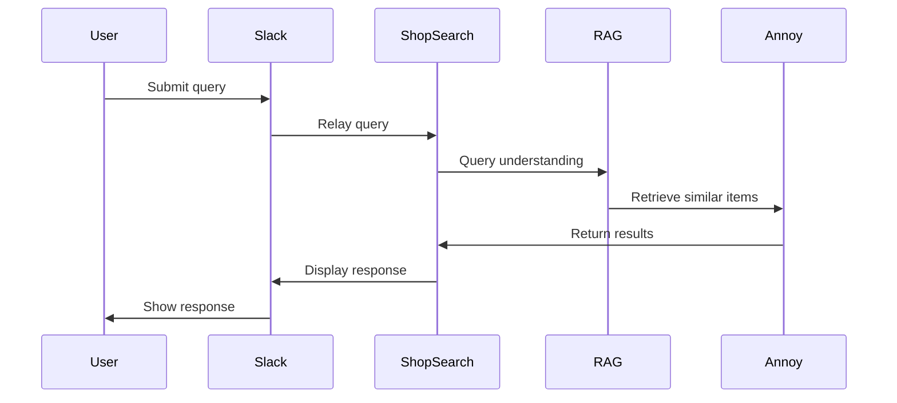
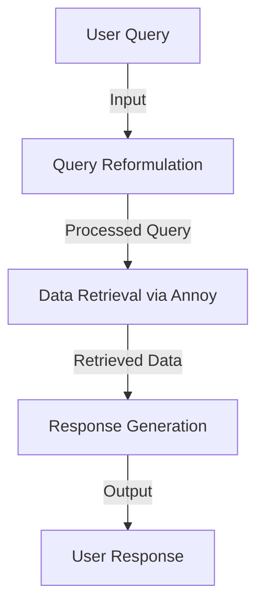

### Enhancing Retail Search Experience through Collaborative Agents and Retrieval-Augmented Models

### Abstract
This paper presents a groundbreaking approach to retail search by combining interactive shop/retail search agents and advanced query intelligence. By leveraging Large Language Models (LLMs), Retrieval-Augmented Generation (RAG), and Approximate Nearest Neighbors (Annoy), we propose a novel framework. This framework, incorporating the ShopSearch Framework and the Smart Retail Navigator, offers a sophisticated solution for enhancing search experiences in dynamic retail settings.

### Introduction
- Highlighting the necessity for improved search mechanisms within the retail sector.
- Discussion on the potential of interactive shop/retail search agents to elevate search experiences.
- Presentation of the Smart Retail Navigator, integrating the ShopSearch Framework with RAG, LLM, and Annoy technologies.

### Related Work
- Examination of scholarly works on LLMs in search contexts, interactive shop/retail search agents, RAG in query processing, and Annoy for data retrieval.
- Identification of technological shortcomings and the rationale for the proposed framework.

### Methodology
- Elaboration on the ShopSearch Framework, detailing its interactive shop/retail search features and integration with communication platforms like Slack.
- Examination of the Smart Retail Navigator, emphasizing:
    - The utilization of RAG and LLMs for sophisticated query handling and response formulation.
    - The application of Annoy for rapid similarity searches in extensive product datasets.

### Mathematical Models and Equations

#### Query Understanding and Reformulation
- **Equation for query vector representation**:
  \[Q_v = \sum_{i=1}^{n} w_i \cdot \text{embed}(q_i)\]
  where \(Q_v\) represents the query vector, \(w_i\) is the weight of term \(i\), \(q_i\) is the term, and \(\text{embed}\) signifies the embedding function.
- **Reformulation mechanism**:
  \[Q_r = \text{RAG}(Q_v, C)\]
  \(Q_r\) denotes the reformulated query, \(RAG\) symbolizes the retrieval-augmented generation process, and \(C\) indicates the context.

#### Search Result Ranking
- **Relevance scoring equation**:
  \[S_r = \alpha \cdot \text{cos}(Q_r, D_v) + \beta \cdot \text{Popularity}(D)\]
  \(S_r\) is the relevance score for a document \(D\), \(D_v\) its vector representation, with \(\alpha\) and \(\beta\) as adjustable parameters.

#### Annoy Index for Efficient Data Retrieval
- **Approximate nearest neighbors equation**:
  \[N_n = \text{Annoy}(D_v, k)\]
  \(N_n\) outlines the \(k\) nearest neighbors to \(D_v\) in a high-dimensional space, as determined by Annoy.

### Implementation
- Detailing the architectural specifics, including interactions among the Slack interface, ShopSearch Framework, and Smart Retail Navigator components.
- Providing code excerpts and explanations for pivotal functionalities like query reformulation and search result amalgamation.

### Case Study: Smart Retail Navigator
- A real-world implementation scenario within retail, showcasing system interaction for product and information discovery.
- Evaluation of system efficacy through metrics such as search precision, response timeliness, and user satisfaction.

### Discussion
- Reflecting on the implications of fusing interactive shop/retail search agents with advanced query intelligence for retail.
- Addressing encountered challenges and proposing potential resolutions.

### Conclusion
- Recapitulating the study's findings and its contributions to the domains of retail search and interactive shop/retail search technologies.
- Suggesting avenues for further research and enhancements to the Smart Retail Navigator.

### References
- Listing all referenced works in a standard citation format.

### Design

1. **System Architecture**: This diagram would showcase the entire system's architecture, highlighting the interconnections between the Slack interface, the ShopSearch Framework, the RAG module, and the Anoy index.

2. **Query Processing Workflow**: This diagram would detail the sequence of steps from receiving a query to generating a response, highlighting the roles of RAG and Annoy in the process.

3. **Data Flow Diagram**: Illustrating the flow of data through the system, from initial user query to the final response.

4. **Annoy Index Search Process**: Visualizing the inner workings of the Annoy index during a search operation.

By restructuring the content with the inclusion of mathematical equations and Mermaid diagram descriptions, we ensure a comprehensive and visually engaging presentation of the research findings, methodologies, and the theoretical underpinnings of the Smart Retail Navigator system.

### References

1. Aliannejadi, M., Kiseleva, J., Chuklin, A., Dalton, J., & Burtsev, M. (2020). ConvAI3: Generating clarifying questions for open-domain dialogue systems (ClariQ). arXiv preprint arXiv:2009.11352.
2. Amershi, S., & Morris, M. R. (2008). CoSearch: a system for co-located collaborative web search. In Proceedings of the SIGCHI conference on human factors in computing systems (pp. 1647–1656).
3. Avula, S., & Arguello, J. (2020). Wizard of oz interface to study system initiative for conversational search. In Proceedings of the 2020 conference on human information interaction and retrieval (pp. 447–451).
4. Avula, S., Arguello, J., Capra, R., Dodson, J., Huang, Y., & Radlinski, F. (2019). Embedding search into a conversational platform to support interactive shop/retail search. In Proceedings of the 2019 Conference on Human Information Interaction and Retrieval (pp. 15–23).
5. Avula, S., Chadwick, G., Arguello, J., & Capra, R. (2018). Searchbots: User engagement with chatbots during interactive shop/retail search. In Proceedings of the 2018 conference on human information interaction & retrieval (pp. 52–61).
6. Avula, S., Choi, B., & Arguello, J. (2022). The effects of system initiative during conversational interactive shop/retail search. Proceedings of the ACM on Human-Computer Interaction, 6(CSCW1), 1–30.
7. Avula, S., Choi, B., & Arguello, J. (2023). Why and When: Understanding System Initiative during Conversational interactive shop/retail search. arXiv preprint arXiv:2303.13484.
8. Brown, T., Mann, B., Ryder, N., Subbiah, M., Kaplan, J. D., Dhariwal, P., Neelakantan, A., Shyam, P., Sastry, G., Askell, A., et al. (2020). Language models are few-shot learners. Advances in neural information processing systems, 33, 1877–1901.
9. Liu, X., Lai, H., Yu, H., Xu, Y., Zeng, A., Du, Z., Zhang, P., Dong, Y., & Tang, J. (2023). WebGLM: Towards An Efficient Web-Enhanced Question Answering System with Human Preferences. arXiv preprint arXiv:2306.07906.
